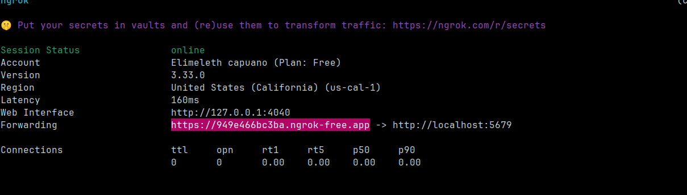
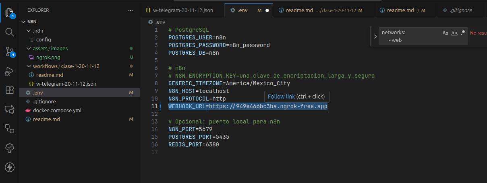

1. Instalar Docker: `curl -sSL https://get.docker.com | sh`
2. Visualizar version de Docker: `docker --version`
3. Visualizar version de Docker Compose:

```bash
# Si usas el plugin moderno:
docker compose version  

# Si usas la versión standalone:
docker-compose version
```

4. Correr compose
`docker compose up -d`

:memo: Espera que se inicien los servicios

5. Ingresar a n8n: http://localhost:5679

## Nota:
Para tener un tunnel https con Ngrok
Ingresar: https://dashboard.ngrok.com/get-started/setup/linux
Seguir los 3 pasos listados

copiar la url 
Pegarla en la .env *WEBHOOK_URL* 