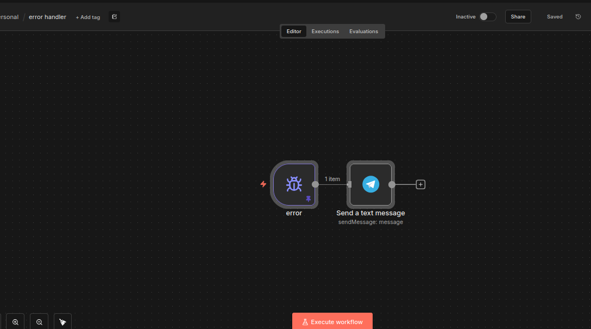
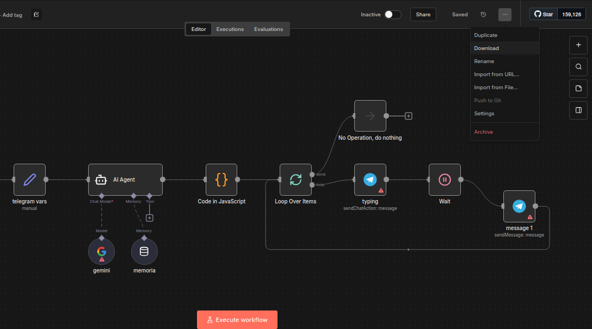
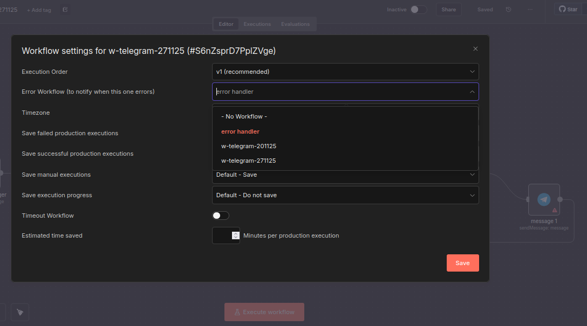

# Obten un tunnel gratuito usadno TuneTLink

# Requisitos:

- [ ] Credencial gemini

- [ ] Token de telegram (Visto en la primera clase).

### Error handler
Maneja todo tipo de errores en nuestro workflows solo funciona en workflows activados.

Crea el flujo error handler 
Configura tu chatId de telegram en el nodo de error handler

En tu flujo de trabajo da click en los 3 puntos 
Agrega el error handler 

:memo: El flujo debe estar activado para que funcione el error handler